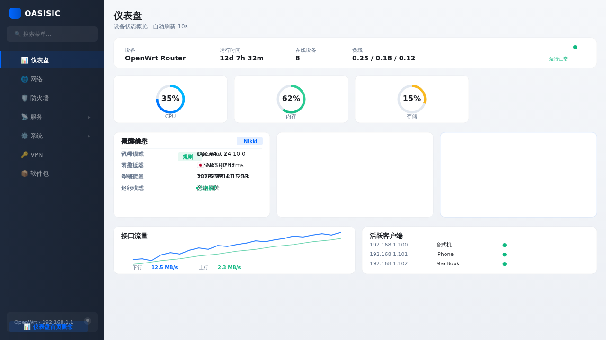

# 🏝️ luci-theme-oasisic

**一款现代优雅的 OpenWrt LuCI 主题** — Apple 风格极简设计，支持旁路网关模式自适应、Nikki 代理状态面板和每日 Bing 壁纸

[](LICENSE)
[](https://openwrt.org)
[](.)

> A modern, elegant OpenWrt LuCI theme with Apple-inspired minimal design, bypass gateway awareness, Nikki proxy integration, and daily Bing wallpapers.

---

### 🌏 中文版本

完整的中文文档请查看 **[README.zh-CN.md](README.zh-CN.md)**，包含详细的功能介绍、安装指南、设计系统和配置说明。

For the full Chinese documentation, please see **[README.zh-CN.md](README.zh-CN.md)**.

---

## 📸 截图预览

| 页面 | 预览 |
|------|------|
| **🔐 登录页** — 毛玻璃卡片 + Bing 每日壁纸 + Passkey/2FA |  |
| **📊 仪表盘** — 探针风格概览 + Nikki 代理状态 + 拓扑 + 流量图 |  |

---

## ✨ 特性亮点

### 🎨 设计风格
- **Apple 极简设计** — 毛玻璃登录卡片、卡片式仪表盘、system-ui 原生字体、精准排版
- **深色/浅色模式** — 跟随系统偏好 `prefers-color-scheme`，支持手动切换（快捷键 `T`）
- **响应式布局** — 桌面 / 平板 / 手机 全适配

### 🌐 旁路网关模式
- 自动检测设备网络角色：WAN 未连接 + 有上游网关 → 自动进入**旁路模式**
- 仪表盘优先展示 Nikki 代理状态、上游网关信息、代理流量占比
- 侧栏标注「旁路」标识，状态栏显示主机路由地址

### ⚡ Nikki 代理集成
- 仪表盘首页实时显示 Nikki 状态卡片：代理模式、节点延迟、今日流量、运行时长
- 跟随 `nikkinikki-org/OpenWrt-nikki` 更新做适配

### 🖼️ 每日壁纸系统
- 登录页自动获取 **Bing 每日壁纸**（国内直连、免 API Key）
- 6 小时自动更换，URL 适配屏幕分辨率
- 失败自动降级到内置深色渐变背景

### 🔐 安全认证
- **Passkey / WebAuthn** — 登录页支持无密码认证（需安装 `webauthn-token`）
- **TOTP 两步验证** — 基于 `oath-toolkit`，支持 Google Authenticator / Authy 扫码绑定
- 两步登录流程：密码验证 → TOTP 验证码 → 登录成功

### 📐 技术特性
- **零外部依赖** — 纯 CSS + JavaScript，不引入 Node.js、CDN 字体或构建工具
- **CSS 自定义属性体系** — 完整的亮/暗模式变量，统一 Design Token
- **Shadow-border 技术** — 代替传统 CSS border，更精细的视觉表现
- **ucode 模板兼容** — 同时支持 Lua 和 ucode 两种模板引擎
- **i18n 国际化** — 英文 + 中文，可扩展其他语言

---

## 🔧 安装方式

### 方式一：预编译包（推荐）

从 [Releases](https://github.com/Hawaiine/luci-theme-oasisic/releases) 下载对应架构的包：

```bash
# OpenWrt 24.10+ (APK)
apk add luci-theme-oasisic_1.0.0_all.apk

# OpenWrt 23.05 (IPK)
opkg install luci-theme-oasisic_1.0.0_all.ipk
```

### 方式二：源码编译

```bash
# 克隆到 OpenWrt 源码目录
git clone https://github.com/Hawaiine/luci-theme-oasisic.git package/luci-theme-oasisic

# 选择主题
make menuconfig
# → LuCI → Themes → luci-theme-oasisic

# 编译
make package/luci-theme-oasisic/compile V=s
```

### 方式三：手动安装

```bash
# 直接复制文件到路由器
cp -r htdocs/luci-static/oasisic /www/luci-static/
cp -r luasrc/* /usr/lib/lua/luci/
cp -r ucode/* /usr/share/ucode/luci/template/
```

安装后，进入 **系统 → 系统 → 语言和界面**，选择「Oasisic」主题。

---

## 🎨 设计系统

### 色彩体系

| Token | 浅色模式 | 深色模式 | 用途 |
|-------|---------|---------|------|
| Primary | `#0071e3` | `#0071e3` | 主色蓝 — 所有可交互元素 |
| Background | `#f5f5f7` | `#1c1c1e` | 页面背景 |
| Card | `#ffffff` | `#2c2c2e` | 卡片/面板 |
| Sidebar | `#1d1d1f` | `#0f0f11` | 侧栏导航 |
| Text Primary | `#1d1d1f` | `#f5f5f7` | 正文 |
| Text Secondary | `#86868b` | `#98989d` | 辅助文字 |
| Success | `#30d158` | `#30d158` | 绿色 — 运行正常 |
| Warning | `#ff9f0a` | `#ff9f0a` | 橙色 — 告警 |
| Danger | `#ff453a` | `#ff453a` | 红色 — 错误 |

### 字体系统

- **主字体：** `system-ui, -apple-system, 'Segoe UI', Roboto, 'Helvetica Neue', sans-serif`
- **等宽字体：** `ui-monospace, SFMono-Regular, Menlo, Monaco, Consolas, monospace`
- **策略：** 零外部字体加载，各平台使用渲染最佳的系统原生字体

### 间距 & 圆角

| 层级 | 尺寸 | 用途 |
|------|------|------|
| `--radius-sm` | 6px | 按钮、输入框 |
| `--radius-md` | 10px | 卡片、面板 |
| `--radius-lg` | 14px | 大卡片 |
| `--radius-xl` | 18px | 外层容器 |

间距基准：4px 递增（4/8/12/16/20/24/32px）

### 旁路模式检测逻辑

```
检测 WAN 口状态
├── WAN 已连接 → 普通路由模式 → 显示 WAN IP、在线设备
└── WAN 未连接 + 有上游网关 → 旁路网关模式
     ├── 状态栏：上游网关 / DNS / 代理状态
     ├── 卡片区：Nikki 优先 / 系统信息 / 网络状态
     ├── 拓扑图：主路由 → 旁路 → 客户端 → 代理节点
     └── 流量图：代理流量（含占比）
```

---

## 🔄 兼容性

| OpenWrt | 状态 | 包格式 | 备注 |
|---------|------|--------|------|
| 25.12+ | ✅ 计划中 | APK | APK 包管理器支持 |
| 24.10 | ✅ 已验证 | APK/IPK | 推荐版本 |
| 23.05 | ✅ 已验证 | IPK | 广泛兼容 |
| 22.03 | ⚠️ 待测试 | IPK | 可能需要微调 |

### 第三方插件适配

| 插件 | 状态 | 说明 |
|------|------|------|
| **luci-app-nikki** | ✅ 完整适配 | 仪表盘首页状态卡片、页面样式适配 |
| luci-app-passwall | ⏳ 计划中 | 插件页面样式适配 |
| luci-app-ssr-plus | ⏳ 计划中 | 插件页面样式适配 |
| luci-app-openclash | ⏳ 计划中 | 插件页面样式适配 |

---

## ⚙️ 配置

### 版本号
修改 `Makefile` 中的 `PKG_VERSION` 即可更新所有页面的版本号显示：

```makefile
PKG_VERSION:=1.0.1  # 改为新版本号
```

### 登录壁纸
默认每 6 小时自动获取 Bing 每日壁纸。如需自定义：
1. 安装 `luci-app-oasisic-config`（规划中）
2. 在配置页面上传自定义背景图
3. 或设置自定义壁纸 URL

### TOTP 两步验证
1. 安装依赖：`opkg install oath-toolkit`
2. 进入 **系统 → 两步验证**
3. 点击「生成密钥」，用 Google Authenticator 扫码
4. 输入验证器生成的 6 位码，点击「启用」
5. 后续登录需输入密码 + TOTP 验证码

---

## 📦 项目结构

```
luci-theme-oasisic/
├── Makefile                          # OpenWrt 编译规则
├── README.md                         # 说明文档（中英双语）
├── LICENSE                           # Apache 2.0
├── .github/workflows/
│   ├── build-test.yml                # CI: 语法检查 + 结构验证
│   └── sync-upstream.yml             # CI: 每日检测上游更新
├── htdocs/luci-static/oasisic/       # 前端静态资源
│   ├── css/
│   │   ├── oasisic.css               # 核心样式（变量 + 布局 + 组件）
│   │   ├── oasisic-dark.css          # 深色模式覆盖
│   │   ├── login.css                 # 登录页专用样式
│   │   └── dashboard.css             # 仪表盘样式
│   ├── js/
│   │   ├── oasisic.js                # 核心 JS（主题切换、侧栏、快捷键）
│   │   ├── login.js                  # 登录页（壁纸、TOTP、表单动画）
│   │   ├── dashboard.js              # 仪表盘（自动刷新）
│   │   └── totp.js                   # 两步验证设置交互
│   └── img/logo.svg                  # 菱形网络节点 Logo
├── luasrc/                           # Lua 后端
│   ├── dispatcher/oasisic.lua        # 主题注册器
│   ├── controller/oasisic/totp.lua   # TOTP 验证控制器
│   └── template/oasisic/             # Lua 模板
│       ├── header.htm                # 页面头部
│       ├── footer.htm                # 页面底部
│       ├── sysauth.htm               # 登录页模板
│       └── totp_setup.htm            # TOTP 设置页
└── ucode/template/oasisic/           # ucode 模板
    ├── header.ut
    └── footer.ut
```

---

## 📌 未来规划

- [ ] `luci-app-oasisic-config` — 可视化主题配置 App（背景图、主题色、布局密度）
- [ ] 实时流量拓扑可视化（类似 UniFi 的节点连线动画）
- [ ] PWA 支持，移动端原生 App 体验
- [ ] 多主题色预设切换（5 套以上配色方案）
- [ ] 仪表盘区块编辑器（拖拽排序、显隐控制）
- [ ] WebSSH 终端主题化
- [ ] 系统健康报告一键导出

---

## 🤝 贡献指南

1. Fork 本仓库
2. 创建功能分支：`git checkout -b feat/your-feature`
3. 提交变更（**使用中文描述**）
4. Push 并创建 Pull Request

> 提交前请在至少 2 个 OpenWrt 版本上测试。

---

## 📄 许可证

Apache 2.0 © 2026 [Oasisic OpenWrt](LICENSE)