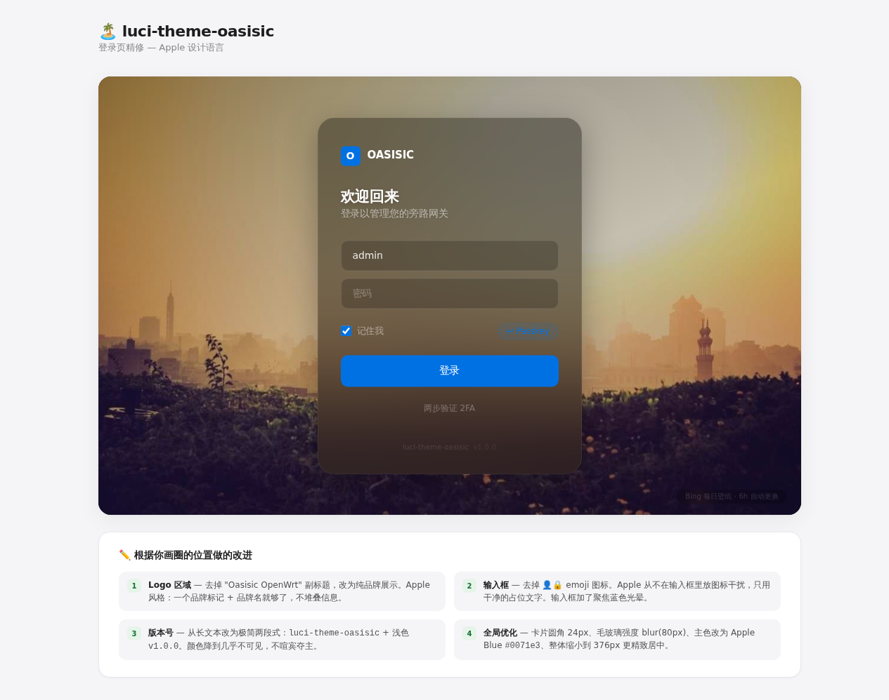
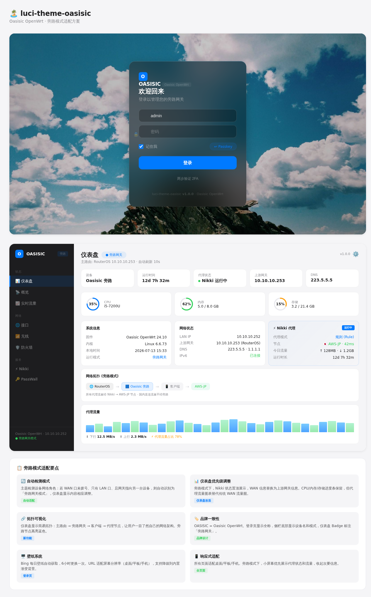

# 🏝️ luci-theme-oasisic

**一款现代、优雅的 OpenWrt LuCI 主题** — Apple 风格极简设计，支持旁路网关模式自适应、Nikki 代理仪表盘、每日 Bing 壁纸。

[](LICENSE)
[](https://openwrt.org)
[](.)

---

## ✨ 特性

- **Apple 风格设计** — 毛玻璃登录页、卡片式仪表盘、精确的排版系统
- **旁路模式自适应** — 自动检测设备是否处于旁路网关模式，调整仪表盘展示优先级
- **Nikki 集成** — 仪表盘首页直接显示 Nikki 代理状态（模式、节点延迟、流量）
- **每日壁纸** — 登录页自动获取 Bing 每日壁纸，6 小时自动更换
- **深色/浅色模式** — 跟随系统偏好，支持手动切换（Ctrl+B 或侧栏开关）
- **Passkey & 2FA 支持** — 登录页支持 WebAuthn 和 TOTP 两步验证
- **响应式布局** — 完美适配桌面端、平板、手机
- **国际化** — 英文 + 中文，可扩展其他语言
- **现代 CSS** — CSS 自定义属性、Shadow-border 技术、平滑过渡
- **零外部依赖** — 纯 CSS/JS，不引入 Node.js、CDN 字体或构建工具

## 📸 截图

| 页面 | 预览 |
|------|------|
| **登录页** ⬇️ |  |
| **仪表盘** ⬇️ |  |

> 截图将在首次发布后补充。

## 🔧 安装

### 方式一：预编译 IPK/APK（推荐）

从 [Releases](https://github.com/Hawaiine/luci-theme-oasisic/releases) 下载：

```bash
# OpenWrt 24.10+ (APK)
apk add luci-theme-oasisic_1.0.0_all.apk

# OpenWrt 23.05 (IPK)
opkg install luci-theme-oasisic_1.0.0_all.ipk
```

### 方式二：从源码编译

```bash
# 克隆到 OpenWrt 源码目录
git clone https://github.com/Hawaiine/luci-theme-oasisic.git package/luci-theme-oasisic

# 选择主题
make menuconfig
# → LuCI → Themes → luci-theme-oasisic

# 编译
make package/luci-theme-oasisic/compile V=s
```

### 方式三：手动安装

```bash
# 直接复制文件
cp -r htdocs/luci-static/oasisic /www/luci-static/
cp -r luasrc/* /usr/lib/lua/luci/
cp -r ucode/* /usr/share/ucode/luci/template/
```

安装后，进入 **系统 → 系统 → 语言和界面** 选择 "Oasisic" 主题。

## ⚙️ 配置

修改 `Makefile` 中的 `PKG_VERSION` 即可更新所有页面显示的版本号：

```makefile
PKG_VERSION:=1.0.1  # 改成新版本号
```

### 登录壁纸

默认每 6 小时自动获取 **Bing 每日壁纸**。如需自定义壁纸：

1. 进入 **系统 → Oasisic 配置**（若安装了 `luci-app-oasisic-config`）
2. 上传自定义背景图
3. 或设置自定义壁纸 URL

回退：无可用壁纸时自动使用深色渐变（`#1a1a2e → #0f3460`）。

## 🎨 设计系统

### 色彩

| 色值 | 浅色模式 | 深色模式 |
|-------|---------|---------|
| 主色蓝 | `#0071e3` | `#0071e3` |
| 背景 | `#f5f5f7` | `#1c1c1e` |
| 卡片 | `#ffffff` | `#2c2c2e` |
| 侧栏 | `#1d1d1f` | `#0f0f11` |
| 文字 | `#1d1d1f` | `#f5f5f7` |

### 字体

- **字体系列：** `system-ui, -apple-system, 'Segoe UI', Roboto, 'Helvetica Neue', sans-serif`
- **等宽字体：** `ui-monospace, SFMono-Regular, Menlo, Monaco, Consolas, monospace`
- 不加载任何外部字体，使用系统原生字体零网络开销

### 旁路模式自适应

主题自动检测设备是否处于旁路网关模式：
- WAN 未连接？有上游网关？→ 自动进入旁路模式
- 仪表盘优先展示 Nikki 状态和上游网关信息
- 侧栏底部标注"旁路"标识

## 🔄 兼容性

| OpenWrt | 状态 | 备注 |
|---------|------|------|
| 25.12+ (APK) | ✅ 计划中 | APK 包支持 |
| 24.10 | ✅ 已验证 | 推荐版本 |
| 23.05 | ✅ 已验证 | IPK 包 |
| 22.03 | ⚠️ 未测试 | 可能需调整 |

**已适配的第三方插件：**

| 插件 | 状态 | 仪表盘集成 |
|------|------|-----------|
| luci-app-nikki | ✅ 完整 | 首页状态卡片 |
| luci-app-passwall | ⏳ 计划 | 插件页面适配 |

## 📌 未来规划

- [ ] `luci-app-oasisic-config` — 可视化主题配置（背景图、主题色、布局）
- [ ] 实时流量拓扑可视化
- [ ] PWA 支持，移动端 App 体验
- [ ] 多主题色预设切换（5 套以上配色方案）
- [ ] 仪表盘区块编辑器（拖拽排序/显隐）
- [ ] WebSSH 终端主题化

## 🤝 贡献

1. Fork 本仓库
2. 创建功能分支（`git checkout -b feat/amazing-feature`）
3. 提交变更（使用中文描述）
4. Push 并提交 Pull Request

提交前请至少在 2 个 OpenWrt 版本上测试。

## 📄 许可证

Apache 2.0 © 2026 [Oasisic OpenWrt](LICENSE)